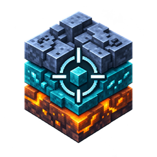

# HypixelClient

<p align="center">
  
</p>

<p align="center">
  An unofficial, experimental client-side Fabric mod for Minecraft 1.21.11, built around Hypixel SkyBlock mechanics.
</p>

<p align="center">
  <a href="https://github.com/chase-irql/HypixelClient/actions/workflows/build.yml"></a>
  <a href="LICENSE"></a>
</p>

> [!CAUTION]
> HypixelClient contains aim assistance, auto-clicking, fishing automation, and macros. Hypixel's
> [allowed modifications guide](https://support.hypixel.net/hc/en-us/articles/6472550754962-Hypixel-Allowed-Modifications)
> says gameplay automation, macros, auto-clicking, and aim assists are disallowed. Do not use
> those features on the Hypixel Network. You are responsible for following every server's rules.

HypixelClient began as EnemyBoxes and grew into a collection of HUD, entity-tracking, minigame, and
automation experiments. The repository is public so the implementation can be inspected,
studied, tested, and improved in the open.

## Features

- Configurable entity boxes, FOV visualization, snaplines, distance labels, and target filters
- Smoothed target selection with line-of-sight, reaction-time, drift, and jitter controls
- CPS counter, click graph, auto-clicker, and auto-swing controls
- Hideonleaf hunting helpers and session shard valuation through Hypixel's public Bazaar API
- Beachball detection, positioning, counters, and automation
- Fishing automation with bite detection, sea-creature combat, and return positioning
- Optional event forwarding for mentions, shutdown warnings, and forced stops
- In-game tabbed settings screen and JSON-backed configuration

All gameplay automation and outbound alert integrations are disabled on a fresh install.

## Requirements

- Minecraft Java Edition 1.21.11
- Fabric Loader 0.18.6 or newer
- Fabric API 0.141.3+1.21.11
- Java 21 or newer

## Install

1. Install Fabric Loader and Fabric API for Minecraft 1.21.11.
2. Download the regular `hypixelclient-<version>.jar` from the latest GitHub release. Do not use the
   `-sources` JAR.
3. Place the JAR in your Minecraft `mods` folder.
4. Start the Fabric profile.

See Fabric's [official mod installation guide](https://docs.fabricmc.net/players/installing-mods)
for launcher-specific details.

## Default controls

| Key | Action |
| --- | --- |
| Right Shift | Open the HypixelClient settings screen |
| Z (hold) | Lock onto the selected target |
| F8 | Print a nearby-entity debug dump |
| H | Toggle Hideonleaf auto hunt |
| J | Toggle the beachball macro |
| K | Toggle auto fishing |

Bindings can be changed in Minecraft's Controls menu. Feature settings are saved to
`config/hypixelclient.json`. Existing `config/enemyboxes.json` settings are imported automatically and
written to the new path on the next load.

## Privacy and networking

HypixelClient has no telemetry or update checker. Two features can access the network:

- The shard tracker requests public pricing data from `api.hypixel.net` while enabled.
- Optional alerts post selected game events to a server URL that you configure yourself. Alert
  forwarding is off by default and no server URL ships with the mod.

Alert credentials are stored in the local configuration file. Never attach an unredacted
`hypixelclient.json` to an issue. See [Configuration and privacy](docs/CONFIGURATION.md) for the payloads,
authentication flow, and setup details.

## Build from source

Clone the repository and run:

```powershell
./gradlew.bat build
```

On macOS or Linux:

```bash
./gradlew build
```

The remapped mod JAR and sources JAR are written to `build/libs/`. The project uses the checked-in
Gradle wrapper; a separate Gradle installation is not required.

For the internal layout and event flow, see [Architecture](docs/ARCHITECTURE.md). Contributions are
welcome through the process in [CONTRIBUTING.md](CONTRIBUTING.md).

## License and trademarks

HypixelClient is released under [CC0 1.0 Universal](LICENSE).

This project is not affiliated with or endorsed by Hypixel Inc., Mojang Studios, Microsoft, or the
Fabric project. Hypixel and SkyBlock are trademarks of their respective owners.
